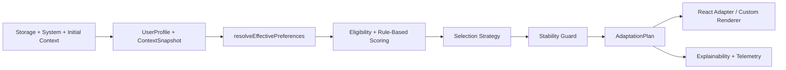

# Architecture

This document explains how the runtime is structured, how data moves through the system, and where each responsibility belongs.

## Architectural Goals

The architecture is optimized for:

- deterministic plan resolution
- thin framework adapters
- strong type boundaries
- local-first execution
- SSR compatibility
- explainability
- safe extension points

## Top-Level Package Boundaries

### `packages/core`

Responsibilities:

- domain model
- surface schemas
- user profile hydration and serialization
- behavior aggregation
- preference resolution
- variant scoring
- hard guards
- stability and hysteresis
- storage contracts
- telemetry contracts
- collector primitives

Non-responsibilities:

- React state wiring
- framework-specific rendering
- visual devtools rendering

### `packages/react`

Responsibilities:

- provider lifecycle
- context propagation
- plan-driven surface rendering
- slot rendering through a registry
- React hooks for plans, preferences, and explanations

Non-responsibilities:

- scoring logic
- browser collectors implementation details
- policy semantics

### `packages/devtools`

Responsibilities:

- showing the current plan
- exposing score breakdowns
- simulation controls
- freeze controls
- event previews

### `packages/otel`

Responsibilities:

- bridging telemetry events to OpenTelemetry
- OTLP HTTP exporter setup for traces and metrics

## Core Runtime Data Flow

## Main Data Structures

### UserProfile

Contains:

- `explicit`
- `learned`
- `metadata`

The explicit section represents user intent.
The learned section represents deterministic heuristics.
Metadata tracks freshness and source.

### ContextSnapshot

Contains runtime state that can affect safe adaptation:

- viewport
- device category
- pointer type
- input modality
- locale/timezone
- feature flags
- server hints
- system accessibility preferences

### SurfaceSchema

Defines a domain screen as a collection of zones.
Each zone provides multiple approved variants.
Each variant can declare:

- traits
- rules
- token overrides
- eligibility predicates

### AdaptationPlan

The plan is the stable intermediate representation between decision-making and rendering.

It contains:

- selected variant per zone
- per-zone candidates and contributions
- token overrides
- resolved preferences
- confidence
- stability metadata
- why trace
- exposure ids

## Planning Pipeline

### Bootstrap

At bootstrap, the engine creates its initial state from:

- persisted profile
- persisted behavior summary
- supplied bootstrap context
- system preference snapshot

This allows the first plan to be computed without remote personalization.

### Preference Resolution

`resolveEffectivePreferences()` merges:

1. explicit preferences
2. policy values
3. learned values
4. system accessibility values
5. defaults

The result includes both resolved values and the source of each value.

### Eligibility

Eligibility runs before scoring.
This prevents invalid variants from competing with valid ones.

Examples:

- mobile-only variant on desktop
- policy-blocked variant
- reduced-motion-incompatible variant

### Scoring

V1 uses deterministic weighted rule-based scoring.
Inputs:

- resolved preferences
- learned affinity scores
- behavior summary
- device context
- zone kind
- variant traits

The output includes both a final score and human-readable contributions.

### Selection Strategy

The strategy interface exists so alternative selection strategies can be introduced later.

Current strategies:

- `RuleBasedStrategy`
- `OptionalEpsilonGreedyStrategy`

The default runtime uses rule-based selection.

### Stability Layer

Stability is a distinct step after scoring.
This is important because:

- the best-scoring variant is not always the best runtime choice
- small score differences should not cause visible churn
- navigation changes must be conservative

Current stability tools:

- hysteresis threshold
- nav cooldown
- surface freeze

## Why Core Is Pure-First

The most important functions are reusable without a browser:

- `resolvePlan()`
- `resolveEffectivePreferences()`
- `explainPlan()`
- `serializeProfile()`
- `hydrateProfile()`

This improves:

- SSR usage
- reproducible testing
- benchmarkability
- reasoning clarity

## Collectors And Browser Boundaries

Collectors isolate browser-specific concerns from decision logic.

Current collectors:

- media query collector
- resize collector
- visibility collector
- interaction collector
- performance collector
- storage sync collector
- view transition capability detector

The engine does not directly depend on these collectors.
It depends on normalized snapshots they produce.

## React Rendering Model

The React adapter follows these rules:

- surface rendering is plan-driven
- slot rendering goes through a component registry
- plan application uses data attributes and CSS variables
- imperative DOM mutation is minimized
- provider owns runtime state but not scoring policy

## Verification Layers

The repository uses multiple verification layers because adaptive UI failures can show up at different abstraction levels.

### Core verification

Core tests assert:

- scoring determinism
- precedence ordering
- hysteresis and cooldown behavior
- serialization and hydration
- persistence behavior
- explainability output

### React verification

React integration tests assert:

- provider bootstrap behavior
- slot rendering from the selected plan
- manual override propagation
- SSR-safe hydration
- focus preservation during allowed adaptation

### Example-app verification

The example dashboard is verified with Playwright to cover:

- preference persistence
- reduced-motion behavior
- persona simulation
- devtools visibility
- focus safety

### Consumer-package verification

`tests/usage` is a separate workspace package that behaves like a downstream application.

It deliberately validates the built package entrypoints by:

- importing `@adaptive-ui/core`
- importing `@adaptive-ui/react`
- defining its own surface schema
- resolving plans outside the demo app
- rendering through `react-dom/server`

It is intentionally configured so this workspace does not alias those package imports back to `src/*`.
That constraint keeps the test honest: it exercises the package contract that downstream users install, not the monorepo's internal source graph.

This layer matters because a library can pass internal tests while still failing for external consumers due to packaging, entrypoint, or runtime-resolution mistakes.

`AdaptiveSurface` computes a plan and exposes it through context.
`AdaptiveSlot` looks up the selected component and renders only approved variants.

## SSR And Hydration Model

The architecture is SSR-safe because the plan can be resolved from deterministic inputs on the server and replayed on the client.

Hydration rules:

- use matching bootstrap profile and context
- do not require network personalization
- only refine after hydration when stability rules allow it
- do not move focus or radically change structure during refinement

## Explainability Model

Explainability is a first-class output, not an afterthought.

The runtime stores:

- preference source per dimension
- selected variant per zone
- blocked candidates
- score contributions
- strategy trace
- stability reasons

This data powers both:

- the public `explainPlan()` API
- the devtools UI

## Extensibility Model

Designed extension points:

- `StorageAdapter`
- `TelemetryAdapter`
- `ExperimentAdapter`
- `SelectionStrategy`

This allows the runtime to grow without turning core planner behavior into framework-specific code.
