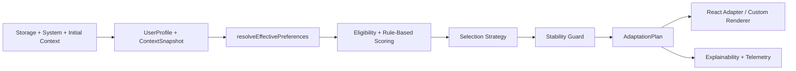

# Architecture

> This document is bilingual. English content comes first, and a Korean summary appears later in the file.
> 이 문서는 영어와 한국어를 함께 제공합니다. 영어 본문이 먼저 나오고, 뒤쪽에 한국어 요약이 이어집니다.

This document explains how the runtime is structured, how data moves through the system, and where each responsibility belongs.

## Architectural Goals

The architecture is optimized for:

- deterministic plan resolution
- thin framework adapters
- strong type boundaries
- local-first execution
- SSR compatibility
- explainability
- safe extension points

## Top-Level Package Boundaries

### `packages/core`

Responsibilities:

- domain model
- surface schemas
- user profile hydration and serialization
- behavior aggregation
- preference resolution
- variant scoring
- hard guards
- stability and hysteresis
- storage contracts
- telemetry contracts
- collector primitives

Non-responsibilities:

- React state wiring
- framework-specific rendering
- visual devtools rendering

### `packages/react`

Responsibilities:

- provider lifecycle
- context propagation
- plan-driven surface rendering
- slot rendering through a registry
- React hooks for plans, preferences, and explanations

Non-responsibilities:

- scoring logic
- browser collectors implementation details
- policy semantics

### `packages/devtools`

Responsibilities:

- showing the current plan
- exposing score breakdowns
- simulation controls
- freeze controls
- event previews

### `packages/otel`

Responsibilities:

- bridging telemetry events to OpenTelemetry
- OTLP HTTP exporter setup for traces and metrics

## Core Runtime Data Flow

## Main Data Structures

### UserProfile

Contains:

- `explicit`
- `learned`
- `metadata`

The explicit section represents user intent.
The learned section represents deterministic heuristics.
Metadata tracks freshness and source.

### ContextSnapshot

Contains runtime state that can affect safe adaptation:

- viewport
- device category
- pointer type
- input modality
- locale/timezone
- feature flags
- server hints
- system accessibility preferences

### SurfaceSchema

Defines a domain screen as a collection of zones.
Each zone provides multiple approved variants.
Each variant can declare:

- traits
- rules
- token overrides
- eligibility predicates

### AdaptationPlan

The plan is the stable intermediate representation between decision-making and rendering.

It contains:

- selected variant per zone
- per-zone candidates and contributions
- token overrides
- resolved preferences
- confidence
- stability metadata
- why trace
- exposure ids

## Planning Pipeline

### Bootstrap

At bootstrap, the engine creates its initial state from:

- persisted profile
- persisted behavior summary
- supplied bootstrap context
- system preference snapshot

This allows the first plan to be computed without remote personalization.

### Preference Resolution

`resolveEffectivePreferences()` merges:

1. explicit preferences
2. policy values
3. learned values
4. system accessibility values
5. defaults

The result includes both resolved values and the source of each value.

### Eligibility

Eligibility runs before scoring.
This prevents invalid variants from competing with valid ones.

Examples:

- mobile-only variant on desktop
- policy-blocked variant
- reduced-motion-incompatible variant

### Scoring

V1 uses deterministic weighted rule-based scoring.
Inputs:

- resolved preferences
- learned affinity scores
- behavior summary
- device context
- zone kind
- variant traits

The output includes both a final score and human-readable contributions.

### Selection Strategy

The strategy interface exists so alternative selection strategies can be introduced later.

Current strategies:

- `RuleBasedStrategy`
- `OptionalEpsilonGreedyStrategy`

The default runtime uses rule-based selection.

### Stability Layer

Stability is a distinct step after scoring.
This is important because:

- the best-scoring variant is not always the best runtime choice
- small score differences should not cause visible churn
- navigation changes must be conservative

Current stability tools:

- hysteresis threshold
- nav cooldown
- surface freeze

## Why Core Is Pure-First

The most important functions are reusable without a browser:

- `resolvePlan()`
- `resolveEffectivePreferences()`
- `explainPlan()`
- `serializeProfile()`
- `hydrateProfile()`

This improves:

- SSR usage
- reproducible testing
- benchmarkability
- reasoning clarity

## Collectors And Browser Boundaries

Collectors isolate browser-specific concerns from decision logic.

Current collectors:

- media query collector
- resize collector
- visibility collector
- interaction collector
- performance collector
- storage sync collector
- view transition capability detector

The engine does not directly depend on these collectors.
It depends on normalized snapshots they produce.

## React Rendering Model

The React adapter follows these rules:

- surface rendering is plan-driven
- slot rendering goes through a component registry
- plan application uses data attributes and CSS variables
- imperative DOM mutation is minimized
- provider owns runtime state but not scoring policy

## Verification Layers

The repository uses multiple verification layers because adaptive UI failures can show up at different abstraction levels.

### Core verification

Core tests assert:

- scoring determinism
- precedence ordering
- hysteresis and cooldown behavior
- serialization and hydration
- persistence behavior
- explainability output

### React verification

React integration tests assert:

- provider bootstrap behavior
- slot rendering from the selected plan
- manual override propagation
- SSR-safe hydration
- focus preservation during allowed adaptation

### Example-app verification

The example dashboard is verified with Playwright to cover:

- preference persistence
- reduced-motion behavior
- persona simulation
- devtools visibility
- focus safety

### Consumer-package verification

`tests/usage` is a separate workspace package that behaves like a downstream application.

It deliberately validates the built package entrypoints by:

- importing `@adaptive-ui/core`
- importing `@adaptive-ui/react`
- defining its own surface schema
- resolving plans outside the demo app
- rendering through `react-dom/server`

It is intentionally configured so this workspace does not alias those package imports back to `src/*`.
That constraint keeps the test honest: it exercises the package contract that downstream users install, not the monorepo's internal source graph.

This layer matters because a library can pass internal tests while still failing for external consumers due to packaging, entrypoint, or runtime-resolution mistakes.

`AdaptiveSurface` computes a plan and exposes it through context.
`AdaptiveSlot` looks up the selected component and renders only approved variants.

## SSR And Hydration Model

The architecture is SSR-safe because the plan can be resolved from deterministic inputs on the server and replayed on the client.

Hydration rules:

- use matching bootstrap profile and context
- do not require network personalization
- only refine after hydration when stability rules allow it
- do not move focus or radically change structure during refinement

## Explainability Model

Explainability is a first-class output, not an afterthought.

The runtime stores:

- preference source per dimension
- selected variant per zone
- blocked candidates
- score contributions
- strategy trace
- stability reasons

This data powers both:

- the public `explainPlan()` API
- the devtools UI

## Extensibility Model

Designed extension points:

- `StorageAdapter`
- `TelemetryAdapter`
- `ExperimentAdapter`
- `SelectionStrategy`

This allows the runtime to grow without turning core planner behavior into framework-specific code.

## 한국어 요약

### 아키텍처 목표

이 런타임은 다음 목표에 맞춰 구조를 나눕니다.

- deterministic plan resolution
- framework adapter의 경량화
- 타입 경계 명확화
- local-first 실행
- explainability와 stability 내장

### 최상위 패키지 경계

각 패키지는 역할이 분리되어 있습니다.

- `core`: 결정 엔진과 타입 시스템
- `react`: 렌더링 adapter
- `devtools`: 디버깅과 시뮬레이션 UI
- `otel`: telemetry export 브리지
- `examples`: 실제 시나리오를 보여주는 데모 앱

핵심 의사결정은 모두 `core`에 남고, UI 프레임워크별 세부 구현은 바깥으로 밀어냅니다.

### 핵심 데이터 흐름

입력은 크게 네 묶음입니다.

- `SurfaceSchema`
- `UserProfile`
- `ContextSnapshot`
- `BehaviorSummary`

이 입력들이 planner로 들어가고, 최종 결과로 `AdaptationPlan`이 나옵니다.
React adapter는 이 plan을 읽어 slot별로 approved variant를 렌더합니다.

### 주요 데이터 구조

아키텍처적으로 중요한 구조는 다음과 같습니다.

- `UserProfile`: explicit, learned, metadata
- `ContextSnapshot`: viewport, system preference, route, session 정보
- `SurfaceSchema`: zones, variants, constraints, token override 연결
- `AdaptationPlan`: 선택 결과와 reasoning trace

### planning 파이프라인

planning 단계는 개념적으로 아래 순서를 따릅니다.

1. effective preference 계산
2. hard guard로 후보 제거
3. score contribution 계산
4. tie-break 수행
5. hysteresis와 cooldown 적용
6. reasoning trace와 exposure metadata 생성

이 순서를 명시적으로 유지해야 나중에 rule을 추가해도 시스템이 설명 가능하게 남습니다.

### core가 pure-first여야 하는 이유

브라우저 API와 상태 변화는 collector나 engine wrapper 계층으로 밀어내고, plan 계산 자체는 최대한 순수 함수로 유지해야 합니다.
그래야 다음이 쉬워집니다.

- unit test
- SSR 재사용
- deterministic debugging
- telemetry와 explainability

### collector와 브라우저 경계

media query, resize, visibility, interaction, performance 같은 브라우저 신호는 collector가 담당합니다.
planner는 collector가 정규화한 정보만 받습니다.
이렇게 해야 planner가 DOM 이벤트 세부사항에 오염되지 않습니다.

### React 렌더링 모델

React adapter는 다음 규칙을 따릅니다.

- surface는 plan 기반으로 렌더
- slot은 component registry를 통해 렌더
- token 적용은 CSS variable과 data attribute 위주
- imperative DOM mutation 최소화
- policy와 scoring은 provider가 아니라 core가 책임짐

### 검증 레이어

이 프로젝트는 여러 층의 검증을 둡니다.

- core unit test
- React integration test
- example app E2E
- consumer usage smoke test

특히 `tests/usage`는 실제 패키지 소비자처럼 built entrypoint를 불러오는지 확인하는 중요한 레이어입니다.

### SSR과 hydration 모델

서버와 클라이언트가 같은 bootstrap input을 쓰면 같은 plan이 계산되어야 합니다.
hydration 이후 refinement는 있더라도 제한적이어야 하고, 세션 중 focus나 landmark 구조가 크게 흔들리면 안 됩니다.

### explainability 모델

설명 가능성은 사후 기능이 아니라 plan의 일부입니다.
현재 구조는 다음을 보존하도록 설계되어 있습니다.

- preference source
- zone별 선택 결과
- blocked candidate 이유
- score contribution
- stability 이유

### 확장성 모델

향후 확장을 위한 인터페이스는 이미 core에 노출되어 있습니다.

- `StorageAdapter`
- `TelemetryAdapter`
- `ExperimentAdapter`
- `SelectionStrategy`

즉, 저장소나 telemetry vendor, exploration strategy가 바뀌더라도 planner 전체를 뒤엎지 않게 설계되어 있습니다.
